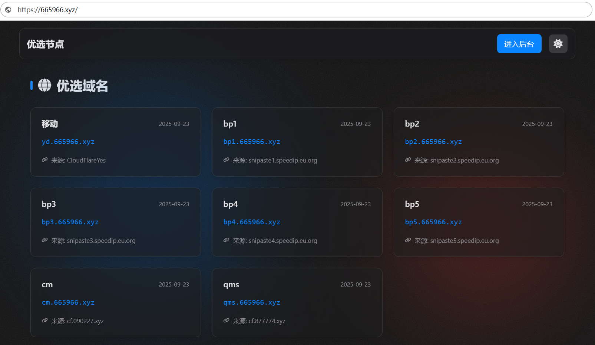
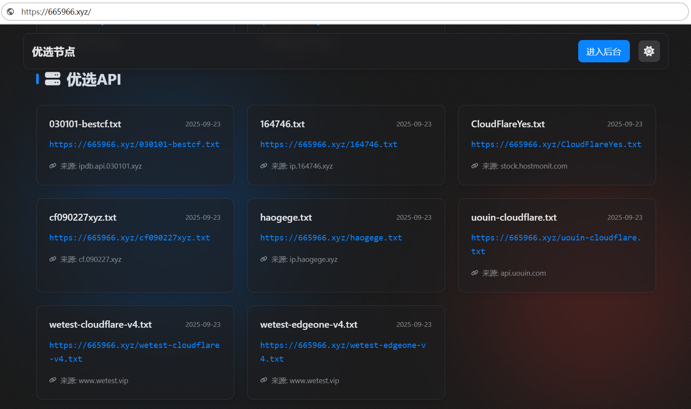

---

<div align="center">

### 🙏 特别鸣谢   CMliu 频道

首先，特别感谢 **CMliu** 频道。本项目中使用的部分核心 `Snippets` 代码及 `ProxyIP` 均源自该频道。

原项目旨在实现域名解析的克隆功能。在日常交流中，我们注意到许多朋友对如何自定义 `Snippets` 节点内容或进行 IP 优选有诸多疑问。为此，我们在原项目的基础上，特别增设了代理功能板块，希望能为大家提供一个方便研究和学习的平台。

---

</div>

<div align="center">
  <a href="https://dash.cloudflare.com/?to=/:account/workers-and-pages/create" target="_blank">
    
  </a>
  <p><strong>一个能让你轻松“白嫖”别人优选域名的 Cloudflare Worker 工具</strong></p>
  <a href="https://t.me/cfwuya1">
    
  </a>
</div>

---

<div align="center">
  <a href="https://www.youtube.com/watch?v=a4Ky4kg1LhI" target="_blank">
    
  </a>
  <br/>
  <a href="https://www.youtube.com/watch?v=a4Ky4kg1LhI" target="_blank">
    
  </a>
</div>

---

## 📑 目录

- [🚀 项目是干嘛的？](#-项目是干嘛的)
- [✨ 主要功能](#-主要功能)
- [🧠 工作原理](#-工作原理)
- [🛠️ 网页部署指南（纯小白教程）](#️-网页部署指南纯小白教程)
- [🧑‍💻 开发者模式（CLI 本地调试 / 部署）](#-开发者模式cli-本地调试--部署)
- [📡 API 接口文档](#-api-接口文档)
- [🗄️ 数据表结构](#️-数据表结构)
- [🔒 安全机制](#-安全机制)
- [❓ 常见问题（FAQ）](#-常见问题faq)
- [🩺 故障排查](#-故障排查)
- [⚠️ 重要声明](#️-重要声明)

---

## 🚀 项目是干嘛的？

简单来说，这个项目能让你**直接克隆任何一个优选好的域名**（比如别人花时间筛选的 CDN 加速域名），并把它所有的 DNS 解析记录实时同步到**你自己的域名**上。

-   **🎯 核心用途：** **域名克隆，实现白嫖。** 看到了好的优选域名？直接输入，一键克隆，别人的优选成果就变成了你的。
-   **📦 额外福利：** **自建 IP 库。** 自动从网上抓取各种优选 IP，并存到你自己的 GitHub 仓库里，形成一个私有的、随时可用的 IP Hub。

所有操作都在 Cloudflare 上完成，免费、高效且稳定。

## ✨ 主要功能

| 功能点                   | 图标 | 描述                                                                                                                              |
| -------------------------- | :--: | --------------------------------------------------------------------------------------------------------------------------------- |
| **一键域名克隆 (核心)**    |  🔄  | **深度克隆** CNAME 记录找到最终 IP，并**实时同步**源站变化，实现全自动“白嫖”。                                                       |
| **聚合 IP 到 GitHub**      |  📦  | **自动化**从多个公开源抓取最新 IP 列表，并自动推送到你自己的 GitHub 仓库。                                                         |
| **三网优选 IP（内置）**    |  🇨🇳  | 内置移动 / 电信 / 联通三网优选 IP 源（hostmonit），一键生成 `yd`/`dx`/`lt` 三条子域名记录，无需手动维护。                              |
| **订阅器友好代理**         |  📡  | **直接访问**同步到 GitHub 的 IP 文件。格式为 `你的 Worker 首页 URL / GitHub 文件路径`，可直接用于各种订阅器，并自带 5 分钟边缘缓存。        |
| **精美的管理后台**         |  🎨  | **简单易用**的密码保护后台，所有配置点点鼠标即可完成，无需懂代码。                                                                  |
| **公开展示页**             |  🌐  | 一个简洁漂亮的首页，展示你克隆的所有域名和 IP 库地址，方便分享和使用。                                                              |

---

## 🧠 工作原理

### 架构总览

```
┌─────────────────────────────────────────────────────────────────┐
│                   Cloudflare Worker（入口）                       │
│                   src/index.ts (fetch + scheduled)               │
└─────────────────────────────────────────────────────────────────┘
                              │
        ┌─────────────────────┼─────────────────────┐
        ▼                     ▼                     ▼
┌────────────────┐    ┌────────────────┐    ┌──────────────────┐
│  /api/*        │    │ /、/login、    │    │  /<github_path>  │
│  API 路由层    │    │ /admin         │    │  GitHub 文件代理 │
│  routes/api.ts │    │ routes/ui.ts   │    │ routes/github-   │
│                │    │                │    │ proxy.ts         │
└───────┬────────┘    └────────┬───────┘    └────────┬─────────┘
        │                      │                     │
        ▼                      ▼                     ▼
┌─────────────────────────────────────────────────────────────────┐
│                    sync 同步层（src/sync/）                       │
│   domains.ts    ip-sources.ts    github.ts                       │
│   ─ 域名克隆    ─ IP 抓取        ─ GitHub API 封装                │
└───────────────────────────┬─────────────────────────────────────┘
                            ▼
┌─────────────────────────────────────────────────────────────────┐
│                    数据层（src/db/）                              │
│   client.ts（D1 封装）+ migrations.ts（幂等建表）                 │
│                    ↓ D1 绑定名：WUYA                              │
└─────────────────────────────────────────────────────────────────┘
```

### 三种同步模式

`sync/domains.ts` 中 `resolveRecordsForDomain` 按源域名前缀分流：

| 模式               | 触发条件                          | 行为                                                                 |
| ------------------ | --------------------------------- | -------------------------------------------------------------------- |
| **系统内置三网**   | `source_domain` 以 `internal:hostmonit:` 开头 | 从 hostmonit 等 HTML 表格源抓取移动/电信/联通 IP，直接写 A 记录         |
| **深度解析**       | `is_deep_resolve = 1`             | 递归追踪 CNAME 链（最多 10 层），直到取出最终 IPv4/IPv6，写 A/AAAA 记录 |
| **浅层克隆**       | `is_deep_resolve = 0`             | 直接克隆源域名的 CNAME 记录（源必须是 CNAME）                          |

### 定时任务调度

Cron `* * * * *`（每分钟）触发 `scheduled` handler，通过 `settings.next_sync_task` 在两种批任务间**轮转**：

```
第 N 分钟：next_sync_task = 'domains'    → 同步 BATCH_SIZE=10 条域名（失败优先）
            执行完毕后翻转：next_sync_task = 'ip_sources'
第 N+1 分钟：next_sync_task = 'ip_sources' → 同步 BATCH_SIZE=10 条 IP 源（失败优先）
            执行完毕后翻转：next_sync_task = 'domains'
```

> **关键设计：** 无论本轮任务成功或失败，状态都会翻转，避免单点失败永久卡死。每批按 `last_sync_status='failed'` 优先、`last_synced_time` 升序选择目标。

---

## 🛠️ 网页部署指南 (纯小白教程)

整个部署过程都在 Cloudflare 网站上完成，**不需要任何命令行工具**。请严格按照以下流程操作：

<div align="center">

**① 创建 Worker ➡️ ② 创建并绑定 D1 ➡️ ③ 初始化并配置 ➡️ ④ 设置定时器 (关键!)**

</div>

### ① 创建 Worker

1.  登录 [Cloudflare 控制台](https://dash.cloudflare.com/)，进入左侧菜单的 **Workers & Pages**。
2.  点击 **创建应用程序 (Create Application)** > **创建 Worker (Create Worker)**。
3.  为你的 Worker 取一个名字（例如 `cf-dns-clon`），然后点击 **部署 (Deploy)**。
4.  部署成功后，点击 **编辑代码 (Edit code)**。
5.  **获取 Worker 代码**——任选以下两种方式之一：

    <details>
    <summary><strong>方式 A：下载打包好的单文件（推荐，零依赖）</strong></summary>

    在本仓库的 [Releases 页面](../../releases) 下载最新版的 `worker.bundle.js`（构建产物，由 `scripts/build-single-file.mjs` 通过 esbuild 从 `src/index.ts` 打包生成），用任意文本编辑器打开，复制**全部内容**。
    </details>

    <details>
    <summary><strong>方式 B：本地构建生成单文件（需要 Node.js）</strong></summary>

    ```bash
    # 1. 克隆仓库
    git clone https://github.com/spew1165/CF-DNS-Clone.git
    cd CF-DNS-Clone

    # 2. 安装依赖（需要 Node.js ≥ 22 + pnpm ≥ 11）
    pnpm install

    # 3. 构建单文件 bundle
    pnpm build:single

    # 4. 复制 dist/worker.bundle.js 的全部内容
    ```
    </details>

6.  将复制到的代码**完整地粘贴**到 Cloudflare 代码编辑器中，覆盖掉原有的示例代码。
7.  点击右上角的 **部署 (Deploy)** 按钮。

> 💡 **为什么不能直接复制 `src/index.ts`？**
> 项目已模块化为多个 `.ts` 文件（详见 [工作原理](#-工作原理)），Cloudflare Dashboard 编辑器只接受单文件入口。`build:single` 会用 esbuild 把所有模块打包成一个可直接运行的 `worker.bundle.js`。

### ② 创建 D1 数据库并绑定

1.  在左侧菜单中，找到并进入 **D1**。
2.  点击 **创建数据库 (Create database)**，填写数据库名称（例如 `wuya-db`），然后点击 **创建 (Create)**。
3.  返回到你的 Worker，进入 **设置 (Settings)** > **变量 (Variables)**。
4.  找到 **D1 数据库绑定 (D1 Database Bindings)**，点击 **添加绑定 (Add binding)**。
5.  **变量名称 (Variable name)** 必须填写 `WUYA` (全大写)。
6.  在 **D1 数据库 (D1 Database)** 下拉列表中，选择你刚刚创建的 `wuya-db`。
7.  点击 **保存并部署 (Save and deploy)**。

<p align="center">
  
</p>

> ⚠️ **绑定名必须是 `WUYA`**。Worker 启动时会检查 `env.WUYA`，缺失会直接返回 500 错误。表结构会在首次访问时由 `initializeAndMigrateDatabase` 自动幂等创建，无需手动执行 SQL。

### ③ 初始化和配置

1.  **设置管理员密码**
    -   访问你的 Worker URL (例如 `https://cf-dns-clon.your-username.workers.dev`)。
    -   页面会引导你设置一个安全的管理员密码（**长度 8–1024 字符**，使用 PBKDF2 哈希存储）。

2.  **获取 API 密钥**
    -   **Cloudflare API (Zone ID 和 API Token):**
        -   **区域 ID (Zone ID):** 在 Cloudflare 域名概述页的右下角复制。
        -   **API 令牌 (API Token):** 前往 **API 令牌** 页面，使用 **“编辑区域 DNS”** 模板为你的域名创建一个新令牌。*（注意：令牌只显示一次，请妥善保管）*
    -   **GitHub Token:**
        -   登录 [GitHub](https://github.com/settings/tokens/new)，点击 **Generate new token (classic)**。
        -   勾选 `repo` 权限（用于自动创建私有仓库 + 推送 IP 文件 + 订阅代理读取），建议设置永不过期，然后生成并复制令牌。*（同样，只显示一次）*

3.  **登录后台进行最终配置**
    -   访问你的 Worker URL 并在后面加上 `/admin` (例如 `https://.../admin`)，使用你的密码登录。
    -   进入 **系统设置** 页面，将上面获取到的所有信息填入对应的输入框中。
    -   点击 **保存设置**。系统会自动验证 Cloudflare 凭据，并为你的域名初始化 8 个内置 IP 源 + 10 个内置域名（含三网优选）。

### ④ 设置定时触发器 (关键步骤！)

> ## ⚠️ **非常重要：必须设置定时触发器，否则无法自动同步！**
>
> 1.  返回到你的 Worker，进入 **设置 (Settings)** > **触发器 (Triggers)**。
> 2.  在 **Cron 触发器 (Cron Triggers)** 部分，点击 **添加 Cron 触发器 (Add Cron Trigger)**。
> 3.  **Cron 表达式** 选择 **每分钟 (`* * * * *`)**，以确保同步的及时性。
> 4.  点击 **添加触发器 (Add trigger)** 保存。

<p align="center">
  
</p>

> 💡 **每分钟一次会不会触发限流？** 不会。每分钟只跑一个批任务（域名 ↔ IP 源轮转），每批最多 `BATCH_SIZE=10` 条，且 `BATCH_SIZE` 可在后台 settings 表里调整。Cloudflare Workers 免费版每天 10 万次请求额度足够。

---

<div align="center">
  🎉 **部署完成！现在去“域名克隆”页面，开始你的“白嫖”之旅吧！** 🎉
</div>

---

## 🧑‍💻 开发者模式（CLI 本地调试 / 部署）

> 以下内容**仅供开发者**使用。普通用户按上面的 4 步网页部署流程即可，无需安装任何工具。

### 环境要求

| 工具 | 版本要求 | 说明 |
| ---- | -------- | ---- |
| Node.js | ≥ 22（推荐 24，见 `.nvmrc`） | 项目要求 `engines.node >= 22` |
| pnpm | ≥ 11 | 直接安装（或 `corepack enable` 后使用） |
| Cloudflare 账号 | —— | 需要 API Token（"编辑区域 DNS"模板） |

> Windows 11 原生支持，无需 WSL。

### 本地开发（`pnpm dev`）

```bash
# 1. 安装 Node 24（推荐用 nvm / fnm）
nvm install 24 && nvm use

# 2. 启用 pnpm（如已安装可跳过）
corepack enable

# 3. 安装依赖（首次）
pnpm install

# 4. 启动本地 workerd 调试环境
pnpm dev
```

- 访问 `http://localhost:8787` 即可进入后台。
- 本地 D1 数据存放在 `.wrangler/state/d1/`，与线上数据库隔离。
- 所有配置（含 Token）仍在后台设置页面填写并存入本地 D1，无需 `.dev.vars`。

### 常用脚本

| 命令                 | 作用                                                       |
| -------------------- | ---------------------------------------------------------- |
| `pnpm dev`           | 启动本地 workerd 调试环境（默认 8787 端口）                  |
| `pnpm test`          | 运行 vitest-pool-workers 测试套件（workerd 内执行）          |
| `pnpm test:coverage` | 运行测试并生成覆盖率报告（istanbul 插桩）                    |
| `pnpm typecheck`     | TypeScript 严格模式检查（`tsc --noEmit`）                    |
| `pnpm build:single`  | 用 esbuild 打包 `src/index.ts` → `dist/worker.bundle.js`    |
| `pnpm predeploy`     | 部署前校验：检查 `wrangler.toml` 中 `database_id` 是否替换   |
| `pnpm deploy`        | CLI 部署到 Cloudflare（自动注入 `.env` 中的 `CLOUDFLARE_API_TOKEN`） |
| `pnpm cf-typegen`    | 重新生成 `worker-configuration.d.ts`（gitignore）            |

### CLI 部署（`pnpm deploy`）

> 先用 `wrangler d1 create` 创建生产 D1 数据库，拿到真实 UUID。

```bash
# 1. 创建生产 D1 数据库（记下输出的 database_id）
pnpm dlx wrangler d1 create wuya-db

# 2. 将返回的 UUID 填入 wrangler.toml 的 database_id
#    （替换占位符 REPLACE_WITH_YOUR_D1_ID）

# 3. 在项目根目录创建 .env，写入账号级 Token（用于 wrangler CLI 认证）
#    CLOUDFLARE_API_TOKEN=xxxxx
#    （获取：CF Dashboard → 我的个人资料 → API Tokens → Edit Cloudflare Workers）

# 4. 部署前校验（占位符未替换会报错退出）
pnpm predeploy

# 5. 部署到 Cloudflare
pnpm deploy
```

> **注意**：`wrangler.toml` 已配置 `keep_vars: true`，不会覆盖你在 Dashboard 里手动配置的 Variables / Bindings。CLI 部署与网页部署两条路径可混用。

### 仓库结构

```
.
├── README.md            # 本文档
├── CLAUDE.md            # 给 AI 助手的代码事实摘要
├── package.json         # 脚本：dev / test / typecheck / deploy / cf-typegen
├── wrangler.toml       # Worker 配置（compatibility_date 2026-01-15，keep_vars）
├── tsconfig.json        # TypeScript strict 配置
├── vitest.config.ts     # vitest-pool-workers 测试配置
├── scripts/
│   ├── build-single-file.mjs  # esbuild 打包 → dist/worker.bundle.js
│   ├── predeploy.cjs          # 部署前占位符校验
│   └── load-deploy-env.cjs    # pnpm deploy 前置：注入 .env 到 wrangler
├── src/
│   ├── index.ts         # Worker 入口（fetch + scheduled 组装，约 80 行）
│   ├── db/              # client.ts（D1 封装）+ migrations.ts（幂等建表）+ migrations/*.sql（测试用）
│   ├── routes/          # api.ts / ui.ts / github-proxy.ts
│   ├── sync/            # domains.ts / ip-sources.ts / github.ts
│   ├── ui/              # templates.js（UI 模板，纯 JS，tsc 不参与）
│   └── util/            # auth / http / log / sse / fetch / cf / url-safety / http-error / run-with-log
├── test/                # vitest-pool-workers 测试（16 文件，workerd 内跑）
└── img/                 # README 截图
```

---

## 📡 API 接口文档

所有 `/api/*` 端点返回 JSON。除 `/api/status`、`/api/setup`、`/api/login` 外，均需在 Cookie 中携带有效 `session`（登录后自动设置，24h 有效）。

### 公开端点

| 方法   | 路径            | 说明                                          |
| ------ | --------------- | --------------------------------------------- |
| `GET`  | `/api/status`   | 查询系统是否已初始化（是否设置了管理员密码）     |
| `POST` | `/api/setup`    | 首次设置管理员密码（密码 8–1024 字符；已初始化后 403） |
| `POST` | `/api/login`    | 密码登录（5 分钟内失败 ≥ 5 次会 429 限流）       |

### 鉴权端点

| 方法   | 路径             | 说明                                                  |
| ------ | ---------------- | ----------------------------------------------------- |
| `POST` | `/api/logout`    | 注销当前会话                                           |
| `GET`  | `/api/settings`  | 读取安全设置（已剔除 Token/密码哈希等敏感字段）         |
| `POST` | `/api/settings`  | 保存设置（白名单：`CF_API_TOKEN` / `CF_ZONE_ID` / `GITHUB_TOKEN` / `GITHUB_OWNER` / `GITHUB_REPO` / `THREE_NETWORK_SOURCE`；CF 与 GitHub 凭据均强制配对校验） |

### 域名管理

| 方法     | 路径                              | 说明                                    |
| -------- | --------------------------------- | --------------------------------------- |
| `GET`    | `/api/domains`                    | 列出所有域名（系统域名排前）              |
| `POST`   | `/api/domains`                    | 添加克隆目标                             |
| `PUT`    | `/api/domains/{id}`               | 更新目标（系统域名的 source 不可改）      |
| `DELETE` | `/api/domains/{id}`               | 删除目标（系统预设禁止删除）              |
| `GET`    | `/api/domains/{id}/records`       | 查询该目标在 Cloudflare 上的当前 DNS 记录 |
| `POST`   | `/api/domains/{id}/sync`          | 立即同步单个目标（返回 SSE 日志流）       |
| `POST`   | `/api/sync`                       | 批量同步所有已启用目标（返回 SSE 日志流）  |
| `POST`   | `/api/domains/sync_system`        | 仅同步系统预设域名（返回 SSE 日志流）     |

### IP 源管理

| 方法     | 路径                              | 说明                                                  |
| -------- | --------------------------------- | ----------------------------------------------------- |
| `GET`    | `/api/ip_sources`                 | 列出所有 IP 源                                         |
| `POST`   | `/api/ip_sources`                 | 添加 IP 源（URL 会先经 SSRF 校验）                     |
| `PUT`    | `/api/ip_sources/{id}`            | 更新 IP 源                                             |
| `DELETE` | `/api/ip_sources/{id}`            | 删除 IP 源                                             |
| `POST`   | `/api/ip_sources/probe`           | 探测 URL，自动选择可用的抓取策略                        |
| `POST`   | `/api/ip_sources/{id}/sync`       | 立即同步单个 IP 源到 GitHub（返回 SSE 日志流）          |
| `POST`   | `/api/ip_sources/sync_all`        | 批量同步所有已启用 IP 源（返回 SSE 日志流）             |

### 订阅器代理（非 API 路径）

访问 `https://<your-worker>/<github_path>`（例如 `https://cf-dns-clon.xxx.workers.dev/CloudFlareYes.txt`）会代理到 GitHub 仓库对应文件，并自带 5 分钟边缘缓存（`Cache-Control: public, max-age=60, s-maxage=300`）。仅代理 `ip_sources` 表中登记过的 `github_path`，未登记返回 404。

---

## 🗄️ 数据表结构

D1 数据库（绑定名 `WUYA`）共 5 张表，由 `initializeAndMigrateDatabase` 在首次请求时幂等创建，24 小时内不会重复执行 DDL。

### `settings`（键值配置）

| 字段   | 类型                  | 说明                                       |
| ------ | --------------------- | ------------------------------------------ |
| `key`  | TEXT PRIMARY KEY      | 配置项名（如 `CF_API_TOKEN`、`BATCH_SIZE`） |
| `value`| TEXT NOT NULL         | 配置值                                      |

> 已知键：`ADMIN_PASSWORD_HASH`、`PASSWORD_SALT`、`CF_API_TOKEN`、`CF_ZONE_ID`、`GITHUB_TOKEN`、`GITHUB_OWNER`、`GITHUB_REPO`、`THREE_NETWORK_SOURCE`、`BATCH_SIZE`（默认 10）、`next_sync_task`、`last_migrated_at`

### `domains`（克隆目标域名）

| 字段                   | 类型       | 说明                                              |
| ---------------------- | ---------- | ------------------------------------------------- |
| `id`                   | INTEGER PK | 自增主键                                          |
| `source_domain`        | TEXT       | 源域名（或 `internal:hostmonit:yd/dx/lt` 内置源）  |
| `target_domain`        | TEXT UNIQUE| 目标域名（自动拼接 `前缀.你的域名`）               |
| `zone_id`              | TEXT       | Cloudflare Zone ID                                |
| `is_deep_resolve`      | INTEGER    | 1=深度解析 CNAME 链；0=浅层克隆 CNAME              |
| `ttl`                  | INTEGER    | DNS 记录 TTL（默认 60）                            |
| `notes`                | TEXT       | 备注                                              |
| `last_synced_records`  | TEXT       | 上次同步的记录 JSON（用于变化检测）                |
| `last_synced_time`     | TIMESTAMP  | 上次同步时间                                       |
| `last_sync_status`     | TEXT       | `success` / `no_change` / `failed` / `pending`    |
| `last_sync_error`      | TEXT       | 上次失败原因                                       |
| `is_enabled`           | INTEGER    | 1=启用；0=禁用                                     |
| `is_system`            | INTEGER    | 1=系统预设（不可删，source 不可改）；0=用户添加     |

### `ip_sources`（IP 抓取源）

| 字段                 | 类型       | 说明                                                          |
| -------------------- | ---------- | ------------------------------------------------------------- |
| `id`                 | INTEGER PK | 自增主键                                                      |
| `url`                | TEXT UNIQUE| 抓取地址                                                      |
| `github_path`        | TEXT UNIQUE| 推送到 GitHub 仓库的文件路径                                   |
| `commit_message`     | TEXT       | Git 提交信息                                                  |
| `fetch_strategy`     | TEXT       | 抓取策略（`direct_regex` / `phantomjs_cloud` / `proxy_codetabs`） |
| `last_synced_time`   | TIMESTAMP  | 上次同步时间                                                   |
| `last_sync_status`   | TEXT       | 同上                                                          |
| `last_sync_error`    | TEXT       | 上次失败原因                                                   |
| `is_enabled`         | INTEGER    | 1=启用；0=禁用                                                 |

### `sessions`（登录会话）

| 字段          | 类型                | 说明                       |
| ------------- | ------------------- | -------------------------- |
| `token`       | TEXT PK             | 会话 Token（UUID）         |
| `expires_at`  | TIMESTAMP           | 过期时间（登录后 24h）     |

### `login_attempts`（登录尝试日志，用于速率限制）

| 字段           | 类型      | 说明                              |
| -------------- | --------- | --------------------------------- |
| `ip`           | TEXT      | 客户端 IP（来自 `CF-Connecting-IP`）|
| `attempted_at` | TIMESTAMP | 尝试时间                          |
| `success`      | INTEGER   | 1=成功；0=失败                    |

> 已建索引 `idx_login_attempts_ip_time`；超过 1 小时的记录会在迁移时自动清理。

---

## 🔒 安全机制

本项目在多个层面内置了安全防护：

| 维度         | 机制                                                                                         |
| ------------ | -------------------------------------------------------------------------------------------- |
| **密码存储** | PBKDF2-HMAC-SHA256，100,000 次迭代 + 随机盐；登录时恒定时间比对（`timingSafeHexEqual`）       |
| **密码兼容** | 旧版本单轮 SHA-256 哈希在登录成功后**自动升级**为 PBKDF2，无需用户改密码                       |
| **登录限流** | 同一 IP 5 分钟内失败 ≥ 5 次返回 429；成功后清空失败记录                                         |
| **会话安全** | Cookie 设置 `HttpOnly` + `Secure` + `SameSite=Strict`；服务端校验过期；登出立即删除            |
| **密码强度** | 后台设置接口校验密码长度 8–1024 字符（上限防 DoS）                                              |
| **SSRF 防护** | `assertSafeHttpUrl` 阻止访问内网/回环/链路本地/CGNAT/云元数据地址（含十进制、十六进制、IPv4-mapped IPv6 等绕过形式） |
| **XSS 防护** | UI 模板所有用户可控字段（notes、target_domain 等）经 `escapeHtml` 转义                          |
| **凭据隔离** | `getSafeSettings` 在返回前端前剔除 `ADMIN_PASSWORD_HASH` / `PASSWORD_SALT` / `CF_API_TOKEN` / `GITHUB_TOKEN` |
| **错误脱敏** | 非 API 路径的全局兜底返回固定文案，杜绝 stack / 凭据泄露；API 路径仅返回 `message`，不含 stack    |
| **写入白名单** | 设置接口仅允许写入预定义的 6 个 key，忽略任意其他字段                                          |
| **配对校验** | CF Token + Zone ID 必须同时提供；GitHub Token + Owner + Repo 必须同时提供                       |
| **网络超时** | 所有外部 fetch 经 `fetchWithTimeout`（默认 10s）+ 指数退避重试，杜绝无界等待                     |
| **迁移门控** | `last_migrated_at` 24h 门控，避免每请求执行整套 DDL                                            |

---

## ❓ 常见问题（FAQ）

<details>
<summary><strong>Q1：为什么必须把 D1 绑定名设为 <code>WUYA</code>？</strong></summary>

Worker 代码通过 `env.WUYA` 访问 D1 数据库。绑定名不符会在启动时抛错并返回 500。这个名字源自上游项目，为保持向后兼容不再变更。
</details>

<details>
<summary><strong>Q2：每分钟跑一次 Cron 会不会浪费免费额度？</strong></summary>

每天 1,440 分钟 = 1,440 次定时调用，加上每次同步内部的 D1 + Cloudflare API + GitHub API 调用，总计约几千次/天，远低于 Cloudflare Workers 免费版的 100,000 次/天额度。如果担心，可在 `settings` 表中调大 `BATCH_SIZE` 并把 Cron 改为 `*/5 * * * *`（每 5 分钟）。
</details>

<details>
<summary><strong>Q3：GitHub Token 为什么需要 <code>repo</code> 权限？</strong></summary>

Worker 会自动：① 创建私有仓库（如不存在）；② 推送 IP 文件到仓库；③ 通过 GitHub API 读取文件供订阅器代理使用。这三步都属 `repo` scope。建议创建一个**专用 Token**，不要用主账号 Token。
</details>

<details>
<summary><strong>Q4：三网优选 IP 是什么？怎么用？</strong></summary>

系统初始化时会自动添加 3 条**系统域名**：`yd.你的域名` / `dx.你的域名` / `lt.你的域名`，分别对应移动/电信/联通优选 IP。这些域名会从 hostmonit 等源实时抓取三网 IP 并写 A 记录，用户可直接用作分流。可在后台设置页切换 `THREE_NETWORK_SOURCE`（`CloudFlareYes` / `api.uouin.com` / `wetest.vip`）。
</details>

<details>
<summary><strong>Q5：深度解析和浅层克隆有什么区别？</strong></summary>

- **深度解析（默认）**：递归追踪源域名的 CNAME 链直到拿到最终 IP，写 A/AAAA 记录。适合源域名背后是 CDN 的情况。
- **浅层克隆**：直接复制源域名的 CNAME 记录。源必须是 CNAME，否则同步失败。适合源域名本身就是另一条 CNAME 的情况。

添加/编辑域名时可在后台切换。
</details>

<details>
<summary><strong>Q6：订阅器如何使用？</strong></summary>

假设你在后台添加了一个 IP 源，`github_path` 为 `CloudFlareYes.txt`，那么订阅器直接填：

```
https://<your-worker>.workers.dev/CloudFlareYes.txt
```

Worker 会代理到你的 GitHub 仓库对应文件，并自带 5 分钟边缘缓存，无需直连 GitHub。
</details>

<details>
<summary><strong>Q7：为什么我粘贴了 <code>src/index.ts</code> 进 Dashboard 报错？</strong></summary>

`src/index.ts` 是模块化源码入口，依赖十几个 `.ts` 文件，Dashboard 编辑器无法解析。请按 [网页部署指南第 ① 步](#①-创建-worker) 下载 Releases 中的 `worker.bundle.js` 或本地 `pnpm build:single` 后粘贴 `dist/worker.bundle.js`。
</details>

<details>
<summary><strong>Q8：忘记管理员密码怎么办？</strong></summary>

进入 Cloudflare D1 控制台，执行：

```sql
DELETE FROM settings WHERE key = 'ADMIN_PASSWORD_HASH';
DELETE FROM settings WHERE key = 'PASSWORD_SALT';
```

然后重新访问 Worker 首页，会引导你设置新密码。
</details>

<details>
<summary><strong>Q9：可以同时用网页部署和 CLI 部署吗？</strong></summary>

可以。`wrangler.toml` 已配置 `keep_vars: true`，CLI 部署不会覆盖你在 Dashboard 手动配置的 Variables / Bindings。但 D1 数据库需要先在 Dashboard 创建好并把 `database_id` 填入 `wrangler.toml`。
</details>

---

## 🩺 故障排查

### 同步状态显示 `failed`

1.  在后台域名/IP 源列表查看 `last_sync_error` 字段。
2.  常见原因：
    - **`Cloudflare API 未配置`** → 进设置页补全 `CF_API_TOKEN` + `CF_ZONE_ID`。
    - **`GitHub API设置不完整`** → 进设置页补全 `GITHUB_TOKEN` + `GITHUB_OWNER` + `GITHUB_REPO`。
    - **`所有抓取策略均未能从该URL获取到IP`** → 源站可能改版或下线，点"探测"重新选择策略，或换源。
    - **`在浅层克隆模式下，源域名必须是一个CNAME记录`** → 改用深度解析，或换一个 CNAME 源。
    - **`Cloudflare API 失败: 403 ...`** → Token 权限不足，确认是"编辑区域 DNS"模板。
    - **`解析深度超过 10 层，可能存在CNAME循环`** → 源域名异常，换源。

### 登录提示"尝试过于频繁"

5 分钟内失败 ≥ 5 次触发限流。等待 5 分钟，或去 D1 控制台执行：

```sql
DELETE FROM login_attempts WHERE ip = '你的IP';
```

### Dashboard 部署后访问 500

几乎一定是 D1 绑定问题：
1.  确认 Workers & Pages → 你的 Worker → 设置 → 变量 → D1 数据库绑定中**变量名为 `WUYA`**（全大写）。
2.  确认数据库已选中并保存部署。
3.  仍未解决，查看 Worker 日志（Cloudflare Dashboard → 你的 Worker → Logs），寻找 `数据库初始化失败` 字样。

### CLI 部署报错 `database_id 仍为占位符`

`wrangler.toml` 中 `database_id` 没替换。先运行 `pnpm dlx wrangler d1 create wuya-db` 拿到真实 UUID，填入后重新 `pnpm deploy`。

### Cron 设了不工作

1.  确认 Cron 表达式是 `* * * * *`（每分钟）。
2.  Cloudflare Dashboard → 你的 Worker → Triggers → Cron Triggers 中能看到该触发器。
3.  查看实时日志，每分钟应出现 `定时任务开始：正在初始化...`。
4.  若日志显示 `Cannot run scheduled ... settings are missing`，说明 CF 或 GitHub 凭据未配置。

### 订阅器代理返回 404

访问的路径不在 `ip_sources.github_path` 白名单中。在后台 IP 源管理页确认路径拼写完全一致（区分大小写）。

---

## ⚠️ 重要声明

本项目/本教程中的所有代码和信息仅供学习和研究之用。

*   **请勿**用于商业或非法目的，否则后果自负。
*   代码来源于互联网，如有侵权请联系删除。
*   项目作者不对任何因使用本项目代码而导致的任何损失或法律纠纷承担责任。
*   使用本项目代码即表示您同意并接受本声明。

**请在遵守您当地法律法规的前提下使用。**
